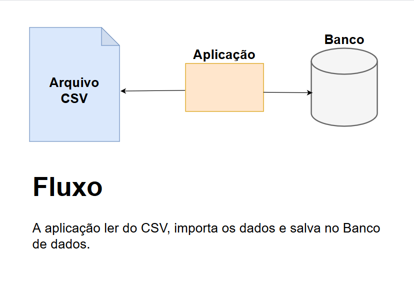

# API Java para consumir CSV

#### Tecnologias

* Java 8
* Banco H2
* Maven 3.6.3

#### Objetivos
Este projeto tem por objetivo a construção de uma aplicação Java para consumir um arquivo CSV.
Trata-se de uma aplicação que faz determinados cálculos com os dados importados, assim como o
CRUD de algumas entidades.

O fluxo básico da aplicação segue como a imagem abaixo:

#### Testes Iniciais
Para fazer o teste desse fluxo pode-se econtrar um arquivo para fins de testes no diretório:
~~~
util/arquivo-csv-test/arquivo-teste.csv
~~~

Também há um arquivo json com a collection com os endpoints para o Postman. Pode-se acha-lo no 
diretório:

~~~
util/collection-postman/api-consumo-csv.postman_collection.json
~~~

# Funcionalidades do Sistema
### Documentação
* Documentação interativa. O acesso a essa URI não requer autenticação:
    * A documentação interativa pode ser encontrada no diretório:
    ~~~
    util/collection-postman/api-consumo-csv.postman_collection.json
    ~~~
### CRUDs
* Recurso para CRUD de usuários;
* Recurso para CRUD de histórico de preço de combustível

### Recursos
* Recurso para importação de csv:
    * Endpoint: **ImportacaoCSVResource**
    * URI:
        ~~~
        localhost:8090/importacao
        ~~~
  
* Recurso que retorne a média de preço de combustível com base no nome do município
    * Endpoint: **DadosImportacaoResource**
    * URI:
        ~~~
        localhost:8090/dadosimportacao
        ~~~
  
* Recurso que retorne todas as informações importadas por sigla da região
    * Endpoint: **DadosImportacaoResource**
    * URI:
        ~~~
        localhost:8090/dadosimportacao/porsiglaregiao
        ~~~
  
* Recurso que retornem os dados agrupados por distribuidora e os dados agrupados pela data da coleta
    * Endpoint: **DadosImportacaoResource**
    * URI:
        ~~~
        localhost:8090/dadosimportacao/dadosAgrupados/1
        ~~~
      Onde, o 1 apresentado na URI representa o tipo de agrupamento desejado. Se para DISTRIBUIDORA, valor 0,
      se para DATA COLETA, valor 1.
      
* Recurso que retorne o valor médio do valor da compra e do valor da venda por município ou por bandeira
    * Endpoint: **DadosImportacaoResource**
    * URI:
        ~~~
        localhost:8090/dadosimportacao/1
        ~~~
        Onde, o 1 apresentado na URI representa o tipo de valor médio desejado. Se para MUNICIPIO, valor 0, 
        se para BANDEIRA, valor 1.